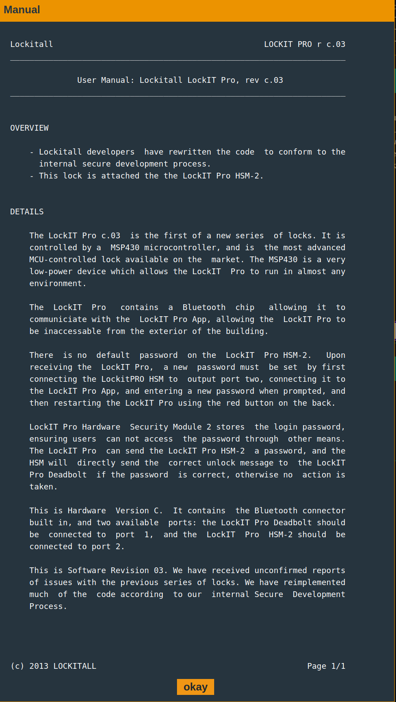
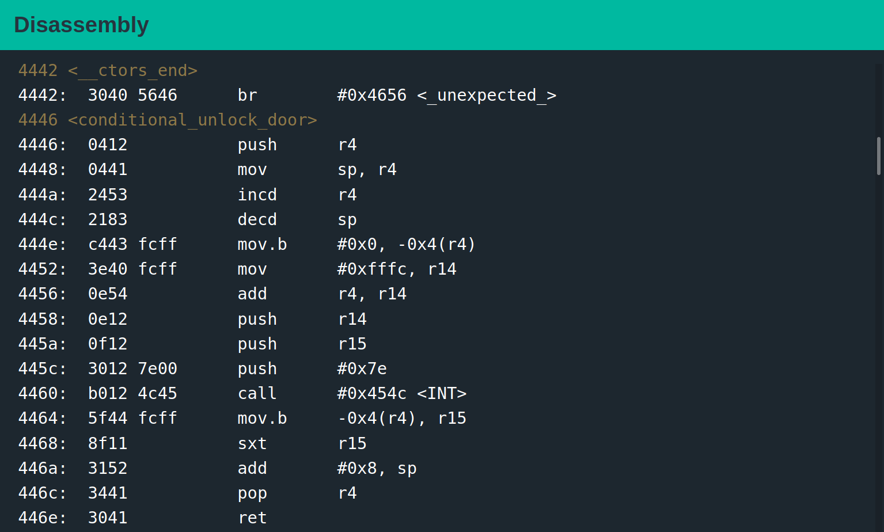
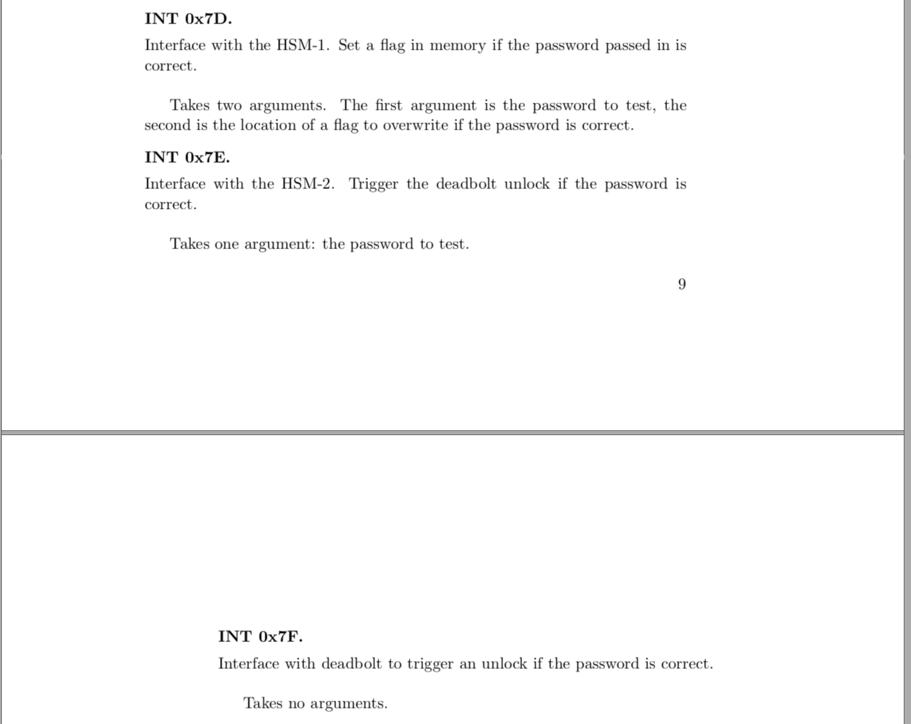
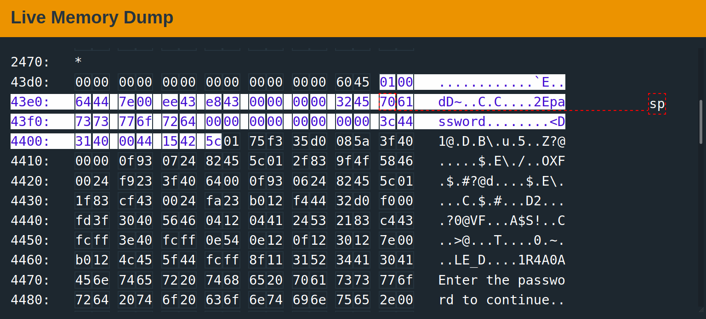

# Embedded Security CTF - Micro-corruptions (Montevideo, Uruguay)

## Lock It Pro rev c.03 - HSM-2  


This capture the flag is hosted on ```https://microcorruption.com/``` 
and was completed for educational purposes. The website hosts a series of challenges containing a fictional doorlock with fictional firmware intended to mimic the real life mistakes engineers make at low level software. The site provides a fictional debugger to experiment and try and come up with a user input that corrupts the software and allow you access to whatever is hidden behind the lock. In this particular instance, the fiction product employs a second generation hardware security module. Authentication logic is not executed on the actual microprocessor, further more there is not specific function included in the software to jump to (there doesn't exist a function which is directly callable that allows a developer to unlock the door). The user manual for the fictional product is shown below. 



## Main Control Flow Function  


The main control flow of the entire program is controlled by a function called ```<conditional_unlock_door>``` . The contents of which can be seen below -------



The program makes an interrupt service request for an interrupt service request at vector address x7d. Looking at the documentation for the LockITPro which is available for reference on ```https://microcorruption.com/```.

Therefore looking more deeply at the assembly language of the interrupt service requires we can see that it looks at higher memory addresses on the stack and executes that specific predefined interrupt handler. The next step in the process is looking up what interrupt handlers we have access to.

![alt text] (int.png)




The fundamental vulnerability with this program is that it a program written in c using a ```strcpy()``` function. ```strcpy()``` does not explicitly define how much memory the input can have. In other word you can over write as much memory as you want. Typically this is called a buffer overflow. We can overflow the imaginary protections that the developer implemented to write to memory addresses that is previously originated on the stack before the most recent function call. We can overwrite the return address of the ```<conditional_unlock_door>``` function and return into an interrupt service request with a x7f as an argument. Describing and figuring out which addresses needed to be overwritten and why was a tedious and lengthy task, pertinent memory addresses are highlighted below. The buffer and overflowed section is from (x43ee - x4446). [x4400] is the return address we jump back to - we set this to [x454c <INT>] and call int using the [x7f argument]. In the famous words of every lazy text book author ever, the explanation is trivially left up to the reader.



In python, the exploit is ```print('90'*16+'4c4599997f')``` in hex. This overflows the amount of the stack we're suppose to write to and overwrite the return address of the ```<conditional_unlock_door>``` function. We return into an interrupt service routine (ISR) and use ```x7f``` which is the universal unlock door interrupt service handler.


The implications of this exploit is that even though many companies are spending tons of money of hardware security modules which communicate over interrupts, you still don't defend yourself from simple buffer overflow attacks.


## Implications of this Exploit

Many companies right now are selling hardware security modules as the next new progression in security. For example, Windows 11 will require a computer hardware security module. To upgrade to Windows 11, half the world will through out perfectly good computers in a post-Moore's Law era which I guess is good for stonks. However, a HSM if implemented poorly, just abstracts code behind a interrupt and doesn't really protect the system. Additionally, it doesn't fix the issue of a classic buffer overflow.

## Defensive Solution

The developer should have used ```strncpy()``` instead of ```strcpy()``` to put the user input onto the stack. Generally, it is bad practice to assume things. ```strcpy()``` assumes that the user will not abuse the fact that the function will copy over any and all addresses unitl it finds a ```x00``` nullbyte. ```strncpy()```lets you explicitly set the amount of memory the buffer can write to. A HSM it is still no substitute for good security practices.


